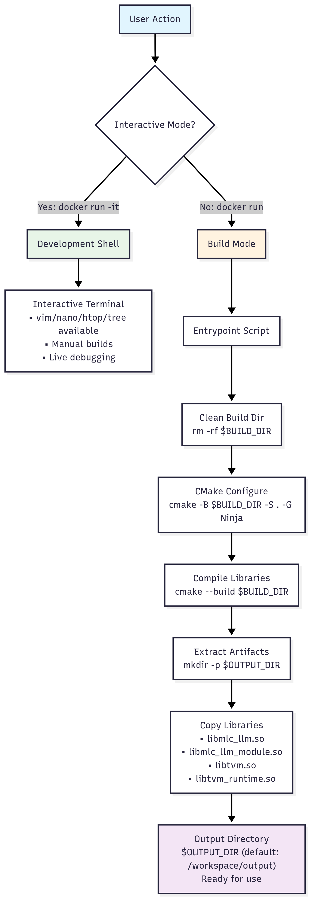
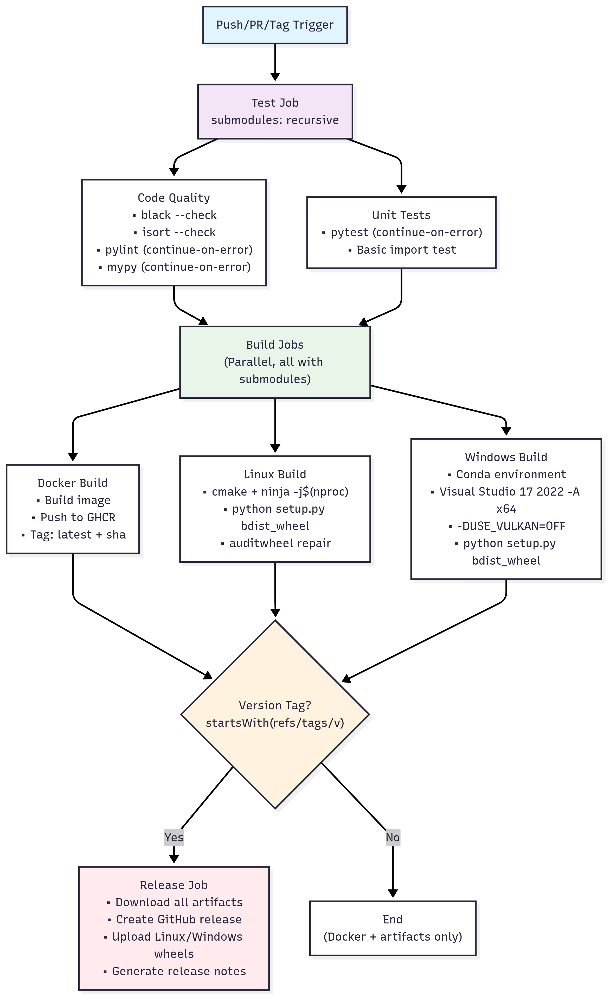

# MLC-LLM Build System Documentation

This document explains the build system files: Dockerfile, entrypoint script, and CI/CD pipeline.

## Prerequisites

To use this build system, you need:
- **Docker** - For containerized builds
- **Git** - For version control and CI/CD triggers  
- **GitHub Actions** - For automated CI/CD (enabled by default on GitHub repos)

### Dependencies

The build system automatically handles these dependencies:

**System Dependencies:**
- Ubuntu 22.04 base system
- Build tools: cmake, ninja-build, build-essential
- Python 3.x with development headers
- Git for source control

**Language Dependencies:**
- **Rust nightly** - Required for tokenizer compilation
- **Python 3** - For package building and testing

**Runtime Dependencies:**
- Generated shared libraries: `libmlc_llm.so`, `libmlc_llm_module.so`
- TVM runtime libraries: `libtvm.so`, `libtvm_runtime.so`

## File Structure

```
mlc-llm/
├── Dockerfile              # Container definition
├── entrypoint.sh           # Smart entry logic
├── .github/workflows/
│   └── ci-cd.yaml         # Pipeline definition
├── python/                # Python package
├── build/                 # Build outputs (created)
└── output/                # Docker artifacts (created)
```

### Docker Flow



#### Key Components

These are the essential dependencies that make the container work for both development and building.

```dockerfile
# Base system with build tools
RUN apt-get update && apt-get install -y \
    build-essential cmake ninja-build git \
    python3 python3-pip python3-dev \
    curl vim nano htop tree
```
- Installs essential build tools (cmake, ninja), compilers (build-essential), Python development headers, and developer utilities (vim, nano, htop for debugging)

```
# Rust toolchain for tokenizers
RUN curl --proto '=https' --tlsv1.2 -sSf https://sh.rustup.rs | \
    sh -s -- -y --default-toolchain nightly
```
- Downloads and installs Rust nightly toolchain needed for compiling tokenizer libraries from source

#### Dual-Purpose Usage

| Mode | Command | Purpose |
|------|---------|---------|
| **Development** | `docker run -it -v "${PWD}:/workspace" mlc-llm:multi` | Interactive shell |
| **Build** | `docker run -v "${PWD}/output:/workspace/output" mlc-llm:multi` | Automated build |

### Entrypoint Script

The entrypoint script is the brain of the container - it automatically detects how you're using the container and switches between development mode (interactive shell) and build mode (automated compilation). Without this script, you'd need separate containers for development and building, which creates maintenance overhead and complexity.

#### Logic Flow

```
Start
  ↓
Interactive? ──Yes──▶ Start Shell
  ↓ No
Build Process
  ↓
├─ Clean build dir
├─ Configure (cmake)
├─ Compile (ninja)
├─ Extract artifacts
└─ Report results
```

#### Core Implementation

The script detects if it's running interactively or for builds, then executes the appropriate workflow.

```bash
# Mode detection
if [ -t 0 ] || [ "$1" = "shell" ]; then
  echo "Starting development shell..."
  exec bash
fi

# Build process
cmake -B "$BUILD_DIR" -S . -G Ninja
cmake --build "$BUILD_DIR"

# Artifact extraction
cp "$BUILD_DIR"/libmlc_llm.so "$BUILD_DIR"/libmlc_llm_module.so "$OUTPUT_DIR"/
cp "$BUILD_DIR"/tvm/libtvm.so "$BUILD_DIR"/tvm/libtvm_runtime.so "$OUTPUT_DIR"/
```

- **Mode detection**: Checks if running in interactive terminal (`-t 0`) or with "shell" argument, then starts bash for development
- **Build process**: Configures CMake with Ninja generator, then compiles the project using all available CPU cores
- **Artifact extraction**: Copies the compiled shared libraries (MLC-LLM core and TVM runtime) to the output directory for use outside container

### Docker Usage Examples

#### Development Workflow

This gives you an interactive shell inside the container with all tools available for coding and testing.

```bash
docker run --rm -it -v "${PWD}:/workspace" mlc-llm:multi
```

- **`--rm`**: Automatically removes container when you exit to keep system clean
- **`-it`**: Provides interactive terminal with proper TTY for running commands and editors
- **`-v "${PWD}:/workspace"`**: Mounts your current directory inside container so you can edit files and see changes immediately

#### Build Workflow

This automatically compiles the entire project and extracts the compiled libraries to your local machine.

```bash
docker run --rm -v "${PWD}/output:/workspace/output" mlc-llm:multi

# Check artifacts
ls output/
# libmlc_llm.so
# libmlc_llm_module.so
# libtvm.so
# libtvm_runtime.so
```

- **No `-it` flags**: Container runs in non-interactive mode, triggering automatic build process
- **Volume mount**: Maps local `output/` directory to container's `/workspace/output` so compiled files appear on your machine
- **Automatic cleanup**: Container removes itself after build completes, leaving only the compiled artifacts

## CI/CD Pipeline

Automated testing, building, and releasing across platforms.

### Pipeline Flow



### Job Structure

#### 1. Test Job
```yaml
- name: Check code formatting
  run: |
    black --check python/mlc_llm --line-length 100
    isort --check-only --profile black python/mlc_llm

- name: Run tests
  continue-on-error: true  # Tests need full build
```

Validates code formatting with black/isort and runs unit tests (non-blocking since tests need compiled modules).

#### 2. Docker Job
```yaml
- name: Build and push
  uses: docker/build-push-action@v5
  with:
    tags: |
      ${{ env.REGISTRY }}/${{ env.IMAGE_NAME }}:latest
      ${{ env.REGISTRY }}/${{ env.IMAGE_NAME }}:${{ github.sha }}
```

Builds the Docker image and pushes it to GitHub Container Registry with both latest and commit-specific tags.

#### 3. Build Jobs (Linux/Windows)
```yaml
# Linux: Native build with auditwheel
- name: Build libraries
  run: |
    mkdir build && cd build
    cmake .. -G Ninja
    ninja -j$(nproc)

# Windows: Conda environment, Vulkan disabled
- name: Build
  run: |
    cmake .. -G "Visual Studio 17 2022" -A x64 -DUSE_VULKAN=OFF
    cmake --build . --config Release
```

Compiles native libraries on Linux (using Ninja) and Windows (using Visual Studio), then packages them into Python wheels for distribution.

### Trigger Strategy

The pipeline runs different combinations of jobs based on what triggered it:

| Event | Test | Build | Release |
|-------|------|-------|---------|
| Push to main | ✅ | ✅ | Docker only |
| Pull Request | ✅ | ✅ | ❌ |
| Version Tag | ✅ | ✅ | ✅ Full |

**Explanation:**
- **Push to main**: Runs tests and builds everything, but only publishes Docker images (not full releases)
- **Pull Request**: Runs tests and builds to validate the PR, but doesn't publish anything to avoid spam
- **Version Tag** (like `v1.0.0`): Full pipeline - tests, builds, creates GitHub release with downloadable wheels and Docker images

### Release Process

Creating a release is simple just tag your commit and push. The pipeline automatically handles building, testing, and publishing everything.

```bash
# Create release
git tag v1.0.0
git push origin v1.0.0
```

### Publishing Steps

When you create a version tag, the pipeline publishes to multiple locations:

**GitHub Container Registry (GHCR):**
- `ghcr.io/your-repo/mlc-llm:latest` - Always latest version
- `ghcr.io/your-repo/mlc-llm:v1.0.0` - Specific version tag
- `ghcr.io/your-repo/mlc-llm:commit-sha` - Commit-specific builds

**GitHub Releases:**
- Downloadable Python wheels for Linux (x64) and Windows (x64)
- Automatically generated release notes
- Tagged source code archives

## Common Issues

**Build fails with missing submodules:**
```bash
git submodule update --init --recursive
```
The project has dependencies (like TVM) as git submodules that need to be initialized and updated before building.

**Different commands for Linux:**
```bash
# Linux/macOS
docker run --rm -it -v "$(pwd):/workspace" mlc-llm:multi
```

**Build fails with permission errors:**
```bash
# On Linux, you might need to fix output directory permissions
sudo chown -R $USER:$USER output/
```


